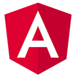

# codough

## インセプションデッキ

今すぐプロダクト・プロトタイピングを作成したい、プロダクト開発・検証向けの「codough」は「コード（code）」と「生地（dough）」の意味を合わせた、プロダクトを作るのに必要なベースとなる成果物を提供するための活動の総称です。

Webベース、かつGitpodを組み合わせたプラットフォームでの提供であり、これはその技術に精通していない誰にでもすぐに動作を確認することができ、他のサンドボックス系のサービスとは違ってプロダクト開発をアジャイルに展開するのに「Sprint 0」として実施しなければいけないことの多くを肩代わりしてくれた状態から開始できるというメリットが備わっています。

## プレーン メニュー

### Webフロントエンド (Nodeベース)

| React (Web) | Vue.js | Angular | 
| --- | --- | --- |
|  |  |  |

### iOS フロントエンド

| UIKit | SwiftUI |
| --- | --- |
|  |  |

### Android フロントエンド

| Android View | Jetpack Compose |
| --- | --- |
|  |  |

### xPlatform フロントエンド

| React Native | Flutter |
| --- | --- |
|  |  |

## CI (継続的インテグレーション)

### AWS Platform

| | | |
| --- | --- | --- |
|  |  |  |

### AWS Amplify コンソール

| | |
| --- | --- |
|  |  |

### GitHub Actions

| |
| --- |
|  |

## CD (継続的デリバリーまたは継続的デプロイメント)

